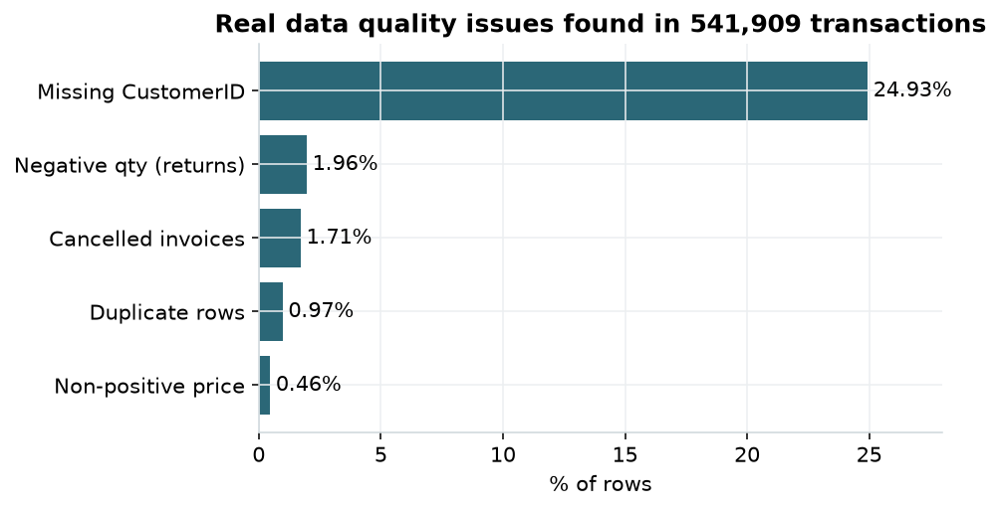
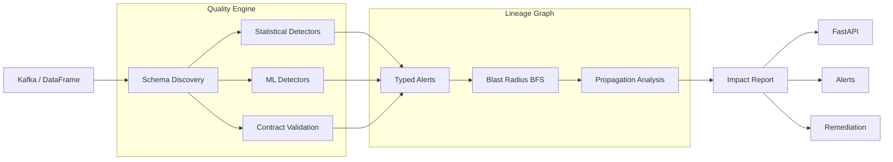

# 🛡️ DataShield

### Intelligent Data Quality, Anomaly Detection & Lineage-Aware Observability Platform

<p align="center">
  <strong>Detect bad data → Understand its impact → Prioritize incidents → Remediate safely</strong>
</p>

<p align="center">
  
</p>

<p align="center">
  <a href="#-overview">Overview</a> •
  <a href="#-key-capabilities">Capabilities</a> •
  <a href="#-architecture">Architecture</a> •
  <a href="#-quick-start">Quick Start</a> •
  <a href="#-api">API</a> •
  <a href="#-testing--metrics">Metrics</a> •
  <a href="#-tech-stack">Tech Stack</a>
</p>

<p align="center">
  
  
  
  
  
  
  
  
</p>

---

## 🚀 Overview

**DataShield** is a real-time data-observability platform designed to monitor tabular data flowing through data pipelines.

It combines:

* 🔎 **Data Quality Detection**
* 🤖 **ML-based Anomaly Detection**
* 🧬 **Data Lineage Tracking**
* 💥 **Blast-Radius Analysis**
* 🚨 **Severity-Based Incident Escalation**
* 🔧 **Safe Remediation**
* ⚡ **FastAPI REST Services**
* 📊 **Interactive Streamlit Dashboard**
* 🌊 **Kafka-Based Streaming**
* 📈 **Optional Observability & Tracing**

DataShield answers three critical questions for every incoming data batch:

| Question                        | DataShield Response                                |
| ------------------------------- | -------------------------------------------------- |
| 🔎 **Is the data broken?**      | Detects statistical, schema and ML-based anomalies |
| 💥 **What will be affected?**   | Calculates downstream lineage and blast radius     |
| 🚨 **What should happen next?** | Ranks severity and supports safe remediation       |

The platform can run in three progressively advanced modes:

```text
┌───────────────────────────────────────────────┐
│             DataShield Execution Modes        │
├───────────────────────────────────────────────┤
│  1. Zero-Infrastructure Demo                  │
│     Python + Pandas + ML                      │
│                                               │
│  2. Full FastAPI Service                     │
│     FastAPI + PostgreSQL + REST APIs          │
│                                               │
│  3. Streaming Production-Like Mode           │
│     Kafka + PostgreSQL + Docker               │
└───────────────────────────────────────────────┘
```

---

# 🎯 Key Capabilities

## 1. 🔍 Data Quality Monitoring

DataShield monitors incoming datasets for common and critical data-quality failures.

### Supported checks

| Detection               | What it identifies                    |
| ----------------------- | ------------------------------------- |
| 📈 Row-count spike      | Unexpected increase in records        |
| 🕳️ Null explosion      | Sudden increase in missing values     |
| 🔢 Cardinality collapse | Unexpected reduction in unique values |
| 📊 Distribution shift   | Significant statistical changes       |
| 🧬 Schema drift         | Changes in column structure or types  |
| 🔐 PII leakage          | Unexpected sensitive information      |
| 🔁 Duplicate records    | Repeated records                      |
| ⚠️ Invalid values       | Zero, negative or abnormal values     |

---

## 2. 🤖 ML Anomaly Detection

DataShield provides multiple ML-based approaches for detecting unusual data behavior.

### Detection methods

```text
                ML ANOMALY DETECTION
                        │
        ┌───────────────┼───────────────┐
        │               │               │
        ▼               ▼               ▼
 Isolation Forest     LOF        Temporal Analysis
        │               │               │
        └───────────────┼───────────────┘
                        ▼
               Multivariate Analysis
```

The ML layer complements traditional statistical data-quality checks.

---

## 3. 🧬 Data Lineage

Data quality problems do not always stop at the table where they occur.

A failed upstream dataset can affect:

```text
Source Table
     │
     ▼
Transformation
     │
     ▼
Warehouse Table
     │
     ├──────────► Dashboard
     │
     ├──────────► ML Features
     │
     └──────────► Business Reports
```

DataShield tracks these dependencies through a **lineage graph**.

---

## 4. 💥 Blast-Radius Analysis

When a table fails, DataShield calculates which downstream assets could be affected.

### Example

```text
RAW_TRANSACTIONS
       │
       ▼
CLEAN_TRANSACTIONS
       │
 ┌─────┼─────────────┐
 ▼     ▼             ▼
BI     ML Model      Report
```

If `RAW_TRANSACTIONS` becomes corrupted:

```text
Affected Assets:
├── CLEAN_TRANSACTIONS
├── BI Dashboard
├── ML Model
└── Business Report
```

The lineage system uses **BFS-based graph traversal** to determine downstream impact.

---

## 5. 🚨 Severity & Escalation

Detected incidents are assigned severity levels and routed according to criticality.

```text
                    INCIDENT
                       │
                       ▼
               Severity Analysis
                       │
          ┌────────────┼────────────┐
          ▼            ▼            ▼
       INFO          WARNING      CRITICAL
          │            │            │
          ▼            ▼            ▼
       Log/Ticket   Alert        Escalation
```

This allows teams to distinguish between routine data issues and incidents requiring immediate attention.

---

## 6. 🔧 Remediation Engine

DataShield includes a remediation layer for situations where an automated response is considered safe.

```text
Detection
    │
    ▼
Validation
    │
    ▼
Severity
    │
    ▼
Remediation Engine
    │
    ├── Safe action
    │
    └── Escalate for human review
```

---

# 🌐 Real-World Dataset Evaluation

One of the key evaluation components uses the **UCI Online Retail dataset** rather than relying only on synthetic data.

### Dataset

| Property            |             Value |
| ------------------- | ----------------: |
| Dataset             | UCI Online Retail |
| Transactions        |           541,909 |
| Period              |         2010–2011 |
| CustomerID missing  |            24.93% |
| Cancelled invoices  |             1.71% |
| Negative quantities |             1.96% |
| Exact duplicates    |             5,268 |

The dataset contains naturally occurring data-quality problems such as missing CustomerIDs, cancelled invoices, negative quantities, zero/negative prices, duplicate records and outliers.

---

# 🧪 Ground-Truth Evaluation

Precision and recall require labelled data.

The real dataset does not provide labels for every possible data-quality fault.

Therefore, DataShield uses:

```text
REAL UCI DATA
      │
      ▼
Clean Data Slice
      │
      ▼
Inject KNOWN Fault
      │
      ├── Null Spike
      ├── Distribution Drift
      ├── Schema Type Change
      ├── PII Injection
      └── Cardinality Collapse
      │
      ▼
Run Detector
      │
      ▼
Compare With Ground Truth
      │
      ▼
Precision / Recall
```

### Reported injected-fault evaluation

| Fault Type                 | Precision | Recall |
| -------------------------- | --------: | -----: |
| Null Spike                 |      1.00 |   1.00 |
| Distribution Drift         |      1.00 |   1.00 |
| Schema Type Change         |      1.00 |   1.00 |
| PII Injection              |      1.00 |   1.00 |
| Cardinality Collapse       |      1.00 |   1.00 |
| Any Fault vs Clean Control |      1.00 |   1.00 |

> **Important:** These faults are deliberately large and unambiguous. Perfect scores demonstrate that the evaluation pipeline correctly detects the injected faults; they do not mean the detector is impossible to fool.

The statistical thresholds also have limitations. For example, the documented `>3σ` distribution check can be insensitive to heavy-tailed Online Retail amounts and required approximately 8× drift to trigger in the documented evaluation.

---

# 🏗️ Architecture

## High-Level Architecture

```text
                         DATA SOURCES
                              │
                ┌─────────────┴─────────────┐
                │                           │
           Kafka Topic                 DataFrame
                │                           │
                └─────────────┬─────────────┘
                              ▼
                 ┌─────────────────────────┐
                 │     QUALITY ENGINE      │
                 ├─────────────────────────┤
                 │ Schema Discovery        │
                 │ Statistical Detection   │
                 │ ML Detection            │
                 │ Contract Validation     │
                 └────────────┬────────────┘
                              │
                       Typed Alerts
                              │
                              ▼
                 ┌─────────────────────────┐
                 │     LINEAGE GRAPH       │
                 ├─────────────────────────┤
                 │ Dependencies            │
                 │ Blast Radius            │
                 │ BFS Traversal           │
                 │ Propagation Probability │
                 │ Criticality Escalation  │
                 └────────────┬────────────┘
                              │
                         Impact Report
                              │
                              ▼
                 ┌─────────────────────────┐
                 │    FASTAPI SERVICE      │
                 ├─────────────────────────┤
                 │ REST APIs                │
                 │ OpenAPI Documentation   │
                 │ Remediation             │
                 │ Optional Tracing        │
                 └─────────────────────────┘
```

---

## 🔄 Processing Flow



---

# ⚡ Quick Start

## Prerequisites

* Python **3.11+**
* Git
* Optional: Docker Desktop
* Optional: PostgreSQL
* Optional: Kafka

---

## 1️⃣ Create Virtual Environment

### Windows

```powershell
python -m venv venv
```

Activate:

```powershell
venv\Scripts\activate
```

### Linux / macOS

```bash
python3 -m venv venv
source venv/bin/activate
```

---

## 2️⃣ Install Dependencies

```bash
pip install -r requirements-full.txt
```

For the lighter Streamlit/demo setup:

```bash
pip install -r requirements.txt
```

---

# 📊 Run the Real-Data Demo

Download the UCI Online Retail dataset:

```bash
python scripts/download_data.py
```

Run the complete demo:

```bash
python run_demo.py
```

### Profile only

```bash
python run_demo.py --profile-only
```

### Evaluation only

```bash
python run_demo.py --eval-only
```

---

# 🖥️ Streamlit Dashboard

DataShield includes an interactive Streamlit dashboard.

Start it with:

```bash
python -m streamlit run streamlit_app.py
```

Then open:

```text
http://localhost:8501
```

The dashboard supports:

* Real Online Retail dataset
* Synthetic dataset
* Interactive incident injection
* Detector visualization
* Data-quality monitoring

---

# 🚀 FastAPI Service

Start the API:

```bash
uvicorn src.api.main:app --port 8000
```

Open:

```text
http://localhost:8000/docs
```

The interactive Swagger/OpenAPI interface allows the available endpoints to be tested directly.

---

# 🐳 Docker

### Core services

```bash
docker compose up
```

### Streaming profile

```bash
docker compose --profile streaming up
```

This adds:

* Kafka
* Zookeeper
* Schema Registry
* Kafka UI

### Full observability profile

```bash
docker compose --profile full up
```

This includes:

* Jaeger
* Prometheus
* Grafana
* Streaming infrastructure
* PostgreSQL
* API

Validate the configuration:

```bash
docker compose config
```

---

# 🧪 Testing

Run unit and integration tests:

```bash
python -m pytest tests/unit tests/integration -q
```

The documented repository test results include **26 passing tests** for the unit/integration suite without external infrastructure.

Additional test categories include:

```text
tests/
├── unit/
├── integration/
├── load/
└── chaos/
```

Load and chaos tests require running services and are not included in the basic unit/integration count.

---

# 🔌 Dependency Matrix

Not every feature requires every infrastructure component.

| Capability                | Standalone |  PostgreSQL | Kafka |
| ------------------------- | :--------: | :---------: | :---: |
| Schema Discovery          |      ✅     |      —      |   —   |
| Statistical Detection     |      ✅     |      —      |   —   |
| ML Anomaly Detection      |      ✅     |      —      |   —   |
| Contract Validation       |      ✅     |      —      |   —   |
| Lineage Graph             |      ✅     |   Optional  |   —   |
| Blast Radius              |      ✅     |   Optional  |   —   |
| Probabilistic Propagation |      ✅     |   Optional  |   —   |
| Remediation               |      ✅     |      —      |   —   |
| Real-Data Evaluation      |      ✅     |      —      |   —   |
| Streamlit Dashboard       |      ✅     |      —      |   —   |
| FastAPI                   |      ✅     | Recommended |   —   |
| Persistent Lineage        |      —     |      ✅      |   —   |
| Streaming Ingestion       |      —     |      ✅      |   ✅   |
| Jaeger Tracing            |      —     |      —      |   —   |

### Architecture principle

```text
Detection + Lineage Core
        │
        ├── No PostgreSQL required
        │
        ├── PostgreSQL → persistence
        │
        └── Kafka → real-time streaming
```

---

# 🔌 API

The FastAPI service exposes the major platform capabilities.

| Method | Endpoint                      | Purpose                       |
| ------ | ----------------------------- | ----------------------------- |
| GET    | `/health`                     | Component readiness           |
| POST   | `/api/quality/discover`       | Learn baseline schema         |
| POST   | `/api/quality/detect`         | Statistical anomaly detection |
| POST   | `/api/ml/detect`              | ML anomaly detection          |
| POST   | `/api/ml/compare`             | Compare detection families    |
| POST   | `/api/lineage/initialize`     | Initialize lineage graph      |
| POST   | `/api/lineage/add-table`      | Add table                     |
| POST   | `/api/lineage/add-dependency` | Add dependency                |
| POST   | `/api/lineage/blast-radius`   | Calculate downstream impact   |
| POST   | `/api/remediation/remediate`  | Detect and remediate          |
| POST   | `/api/contracts/register`     | Register data contract        |
| POST   | `/api/contracts/validate`     | Validate data contract        |
| POST   | `/api/gnn/train`              | Experimental GNN training     |
| POST   | `/api/gnn/predict`            | GNN prediction                |
| POST   | `/api/gnn/compare`            | Compare GNN vs heuristic      |

Full API documentation:

```text
http://localhost:8000/docs
```

---

# 🧩 Python Library Usage

DataShield components can also be used directly from Python.

```python
import pandas as pd

from quality_engine.schema import SchemaDiscovery
from quality_engine.anomaly_detector import AnomalyDetector
from lineage.database import LineageDB
from lineage.blast_radius import BlastRadiusCalculator


# 1. Learn a baseline
baseline = SchemaDiscovery().discover(
    df_yesterday,
    "transactions"
)

# 2. Detect drift in a new batch
alerts = AnomalyDetector(baseline).detect(
    df_today
)

# 3. Build lineage
db = LineageDB()

raw = db.add_table(
    "raw_events",
    "source",
    "data_eng",
    "de@co.com",
    "critical",
    "real-time"
)

clean = db.add_table(
    "cleaned_events",
    "transformation",
    "data_eng",
    "de@co.com",
    "high",
    "hourly"
)

db.add_dependency(
    raw,
    clean,
    latency_minutes=5
)

# 4. Calculate downstream impact
report = BlastRadiusCalculator(db).calculate(raw)

print(report.total_affected)
print(report.critical_affected)
```

---

# 📈 Testing & Metrics

DataShield intentionally separates verified measurements from assumptions or aspirational claims.

| Metric / Claim                                   | Status                                    |
| ------------------------------------------------ | ----------------------------------------- |
| Real UCI dataset                                 | ✅ Verified                                |
| 541,909 transactions                             | ✅ Verified                                |
| Real quality issues                              | ✅ Measured                                |
| Injected-fault evaluation                        | ✅ Verified                                |
| Five injected fault types                        | ✅ Evaluated                               |
| Precision / Recall on documented injected faults | ✅ 1.00 / 1.00                             |
| Clean control evaluation                         | ✅ 1.00 / 1.00                             |
| Unit + integration tests                         | ✅ 26 documented passing                   |
| Docker Compose configuration                     | ✅ Validates                               |
| Large-scale latency claims                       | ⚠️ Require hardware-specific load testing |

### Important limitation

The documented perfect precision/recall results come from deliberately injected and relatively obvious faults.

They should **not** be interpreted as evidence that the system can detect every subtle production anomaly.

---

# 🧠 Known Limitations

DataShield's documented evaluation also identifies several limitations:

### 1. Statistical thresholds

Some statistical detectors depend on thresholds and may miss subtle distribution changes.

### 2. Heavy-tailed data

The Online Retail dataset contains heavy-tailed amount distributions, which can reduce the sensitivity of simple statistical checks.

### 3. Domain dependence

The primary real-data evaluation uses one e-commerce dataset. Additional domains would provide broader validation.

### 4. Infrastructure requirements

Advanced streaming and persistence features require additional infrastructure such as:

```text
PostgreSQL
Kafka
Schema Registry
Observability stack
```

### 5. Automated remediation

Automated fixes should be applied only when the remediation action is known to be safe. Otherwise, human review should be preferred.

---

# 🛠️ Tech Stack

| Layer         | Technology                | Role                        |
| ------------- | ------------------------- | --------------------------- |
| API           | FastAPI                   | REST service                |
| Server        | Uvicorn                   | ASGI server                 |
| Validation    | Pydantic                  | Request/response validation |
| Data          | Pandas                    | Data processing             |
| Numerical     | NumPy                     | Numerical computation       |
| Statistics    | SciPy                     | Statistical detection       |
| ML            | scikit-learn              | Anomaly detection           |
| Database      | PostgreSQL                | Lineage persistence         |
| ORM           | SQLAlchemy                | Database access             |
| Migration     | Alembic                   | Schema migrations           |
| Streaming     | Kafka                     | Real-time ingestion         |
| Schema        | Confluent Schema Registry | Avro schema management      |
| Dashboard     | Streamlit                 | Interactive UI              |
| Observability | OpenTelemetry             | Distributed tracing         |
| Tracing       | Jaeger                    | Trace visualization         |
| Metrics       | Prometheus                | Metrics collection          |
| Visualization | Grafana                   | Monitoring dashboards       |
| Packaging     | Docker                    | Containerization            |
| Orchestration | Docker Compose            | Local service orchestration |
| Deployment    | Helm / Kubernetes         | Kubernetes deployment       |

---

# 📁 Repository Structure

```text
DataShield/
│
├── 📄 run_demo.py
├── 📄 streamlit_app.py
├── 📄 Dockerfile
├── 📄 docker-compose.yml
├── 📄 pyproject.toml
├── 📄 requirements.txt
├── 📄 requirements-full.txt
├── 📄 METRICS.md
├── 📄 README.md
├── 📓 demo.ipynb
│
├── 📂 scripts/
│   └── download_data.py
│
├── 📂 src/
│   │
│   ├── 📂 api/
│   │   └── main.py
│   │
│   ├── 📂 quality_engine/
│   │   ├── schema.py
│   │   └── anomaly_detector.py
│   │
│   ├── 📂 ml_features/
│   │   └── ml_anomaly_detector.py
│   │
│   ├── 📂 lineage/
│   │   ├── database.py
│   │   ├── blast_radius.py
│   │   └── graph_optimizer.py
│   │
│   ├── 📂 contracts/
│   │   ├── registry.py
│   │   ├── validator.py
│   │   └── examples.py
│   │
│   ├── 📂 remediation/
│   │   ├── actions.py
│   │   └── engine.py
│   │
│   ├── 📂 streaming/
│   │   ├── kafka_producer.py
│   │   ├── kafka_consumer.py
│   │   └── schema_registry_client.py
│   │
│   ├── 📂 observability/
│   │   └── tracing.py
│   │
│   ├── 📂 eval/
│   │   ├── real_data.py
│   │   ├── fault_injection.py
│   │   └── evaluate.py
│   │
│   └── 📂 gnn/
│       └── cascade_predictor.py
│
├── 📂 tests/
│   ├── 📂 unit/
│   ├── 📂 integration/
│   ├── 📂 load/
│   └── 📂 chaos/
│
├── 📂 helm/
│   └── datashield/
│
├── 📂 benchmarks/
│
├── 📂 docs/
│
└── 📂 assets/
    └── hero.png
```

---

# 🔬 Core Modules

| Module           | Responsibility                                  |
| ---------------- | ----------------------------------------------- |
| `quality_engine` | Schema discovery and statistical quality checks |
| `ml_features`    | ML anomaly detection                            |
| `lineage`        | Dependency graph and blast-radius calculation   |
| `contracts`      | Data contract registration and validation       |
| `remediation`    | Remediation actions and engine                  |
| `streaming`      | Kafka producer/consumer integration             |
| `observability`  | OpenTelemetry tracing                           |
| `eval`           | Real-data profiling and fault evaluation        |
| `gnn`            | Experimental cascade prediction                 |

---

# 📊 DataShield Workflow

```text
                  ┌─────────────────┐
                  │   Data Source   │
                  └────────┬────────┘
                           │
                           ▼
                  ┌─────────────────┐
                  │ Data Ingestion  │
                  └────────┬────────┘
                           │
                           ▼
              ┌──────────────────────────┐
              │     Quality Engine       │
              │                          │
              │ Schema + Statistics + ML │
              └────────────┬─────────────┘
                           │
                           ▼
                  ┌─────────────────┐
                  │ Alert Generation│
                  └────────┬────────┘
                           │
                           ▼
                  ┌─────────────────┐
                  │ Lineage Graph   │
                  └────────┬────────┘
                           │
                           ▼
                  ┌─────────────────┐
                  │ Blast Radius    │
                  └────────┬────────┘
                           │
                           ▼
                 ┌──────────────────┐
                 │ Severity / Route │
                 └────────┬─────────┘
                          │
                ┌─────────┴──────────┐
                ▼                    ▼
        ┌──────────────┐     ┌────────────────┐
        │ Human Alert  │     │ Safe Remediation│
        └──────────────┘     └────────────────┘
```

---

# 🧪 Reproducibility

The project is designed so that the main evaluation can be reproduced locally without paid API keys or external cloud infrastructure.

### Minimum demo

```bash
python scripts/download_data.py
python run_demo.py
```

### Dashboard

```bash
python -m streamlit run streamlit_app.py
```

### API

```bash
uvicorn src.api.main:app --port 8000
```

### Tests

```bash
python -m pytest tests/unit tests/integration -q
```

---

# 🔐 Data & Privacy Considerations

The real-data evaluation uses the public **UCI Online Retail** dataset.

For production deployments:

* Avoid logging sensitive values.
* Apply access control to lineage metadata.
* Protect database credentials.
* Do not expose PII through dashboards.
* Validate remediation actions before automatic execution.
* Use environment variables for secrets.

---

# 🗺️ Execution Modes

## 🟢 Development / Learning

```text
Python
 │
 ├── Pandas
 ├── NumPy
 ├── scikit-learn
 └── Streamlit
```

No external infrastructure required.

---

## 🟡 API Mode

```text
Client
   │
   ▼
FastAPI
   │
   ├── Quality Engine
   ├── ML Detection
   ├── Lineage
   └── Remediation
           │
           ▼
      PostgreSQL
```

---

## 🔴 Streaming Mode

```text
Data Producers
      │
      ▼
    Kafka
      │
      ▼
DataShield Consumer
      │
      ├── Quality Engine
      ├── ML Detection
      └── Lineage
              │
              ▼
        PostgreSQL
              │
              ▼
       FastAPI / Alerts
```

---

# 📚 Documentation

Additional technical documentation is available inside:

```text
docs/
benchmarks/
METRICS.md
demo.ipynb
```

Key topics include:

* ML anomaly detection
* Probabilistic propagation
* BFS-based lineage optimization
* Evaluation methodology
* Benchmarking

---

# 📜 License

This project is distributed under the **MIT License**.

See:

```text
LICENSE
```

---

# 👤 Original Project

DataShield was originally built by:

**Koutilya Yenumula**

GitHub:

https://github.com/koutilyaY

This repository is maintained as a learning/development fork for experimentation, understanding, modification and extension of the DataShield platform.

---

# ⭐ Project Summary

```text
DataShield
│
├── 🔍 Data Quality Monitoring
├── 🤖 ML Anomaly Detection
├── 🧬 Data Lineage
├── 💥 Blast-Radius Analysis
├── 🚨 Severity-Based Escalation
├── 🔧 Remediation Engine
├── ⚡ FastAPI
├── 📊 Streamlit Dashboard
├── 🌊 Kafka Streaming
├── 🐘 PostgreSQL
├── 🐳 Docker
├── 📈 Observability
└── ☸️ Kubernetes / Helm
```

> **Detect the problem. Understand the impact. Prioritize the incident. Respond safely.**

---
